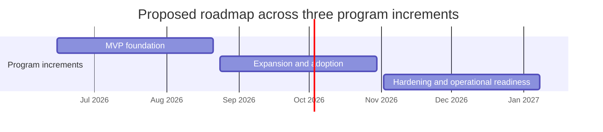

# SAFe PI Roadmap and Source Plan for a SAS RAG MCP App

## Executive summary

For a SAS-focused RAG + MCP application, the highest-leverage starting point is a **small, high-trust corpus of official SAS programming references** rather than a broad scrape of every SAS-related artifact. SAS already publishes a programming documentation home for SAS 9.4 and SAS Viya, alongside product-specific manuals for Base SAS language concepts, macro language, DATA step statements, functions, formats/informats, SQL, DS2, FedSQL, component objects, CAS, and administrative guidance. Those references are exactly the kinds of syntax-heavy, example-rich materials that produce strong retrieval signals for coding assistants. citeturn10search6turn5search4turn5search7turn7search0turn10search0turn42search1turn36search0

A lightweight **SAFe-style** operating model fits this sub-project well, but it should be adapted to your current scale. SAFe positions PI Planning as a cadence-based ART event, typically run as a **two-day planning event every 8–12 weeks**, and features are expected to be sized so they can be delivered within a PI. Because your team size and delivery capacity are unspecified, the most practical interpretation is a **single-product, role-hatted ART** with you as project owner and interim business owner/product manager, and with explicit scope control around corpus, retrieval, evaluation, and MCP surface. citeturn26view0turn27view0turn22search23

Architecturally, the first version should be **retrieval-first, not execution-first**. The MCP spec is designed around **resources, prompts, and tools**; LangChain’s current retrieval guidance supports both standard and agentic RAG patterns; LangSmith provides dataset-based offline evaluation and online quality monitoring; and MarkItDown is well suited to turning PDFs and office documents into Markdown while preserving headings, lists, tables, and links for downstream chunking. That combination is a strong foundation for a trusted SAS reference server that can support your coding CLI or editor integrations. citeturn18search9turn18search13turn18search6turn18search2turn18search11turn18search14turn18search0turn18search1turn18search5turn18search8turn19search0

The most important implementation discipline is **version-aware retrieval**. SAS 9.4 and older releases are documented under a fixed-lifecycle model, while the SAS Viya platform uses a more modern continuous-delivery approach; SAS also publishes explicit migration guidance from SAS 9.4. Your metadata and retrieval filters therefore need to preserve product family, major version, maintenance/release cadence, publication date, and source priority, or your assistant will mix incompatible answers across SAS 9.4, Viya 3.5, and current Viya platform documentation. citeturn12search14turn17search0turn17search2turn11search15

## Assumptions and scope

This report treats your app as a **SAS reference and code-understanding service** implemented with LangChain and exposed through MCP. It assumes a lightweight SAFe-style planning model rather than a literal large ART, because SAFe’s public guidance is written for ART-level alignment and Agile teams, while your team size, infrastructure footprint, and staffing remain unspecified. citeturn26view0turn22search23

| Planning variable | Current status |
|---|---|
| Team size | **Unspecified** |
| Named engineering roles | **Unspecified** |
| Budget and cloud/provider choice | **Unspecified** |
| Embedding model and vector store | **Unspecified** |
| SAS runtime availability for code execution | **Unspecified** |
| Target clients | Coding CLI and GitHub Copilot–style editor/client workflows via MCP |
| Proposed cadence for planning | **Ten-week PI planning assumption** for roadmap purposes only, because SAFe places PIs on an 8–12 week cadence and PI Planning occurs in the IP iteration. citeturn26view0turn25search7 |

A practical scoping rule for the MVP is this: the app should answer **syntax, semantics, procedure usage, example retrieval, and migration/version questions** from trusted sources before it attempts autonomous SAS code execution or broad community synthesis. Official SAS docs and SAS-authored papers should dominate the ranking model; community content and GitHub examples should be subordinate supplements. That prioritization aligns with the structure of SAS’s programming and support documentation, plus the existence of official SAS code example repositories and support communities. citeturn10search6turn5search4turn14search9turn14search1turn14search2

A short list of official implementation references you will likely want in the repository from day one is below.

| Reference | URL |
|---|---|
| LangChain retrieval docs | `https://docs.langchain.com/oss/python/langchain/retrieval` |
| LangChain RAG tutorial | `https://docs.langchain.com/oss/python/langchain/rag` |
| LangSmith evaluation docs | `https://docs.langchain.com/langsmith/evaluation` |
| MCP specification | `https://modelcontextprotocol.io/specification/2025-03-26` |
| MCP tools page | `https://modelcontextprotocol.io/specification/2025-06-18/server/tools` |
| MCP resources page | `https://modelcontextprotocol.io/specification/2025-06-18/server/resources` |
| MCP prompts page | `https://modelcontextprotocol.io/specification/2025-06-18/server/prompts` |
| MarkItDown | `https://github.com/microsoft/markitdown` |
| SAS documentation home | `https://support.sas.com/en/documentation.html` |

These are all official sources for the frameworks and standards involved. citeturn18search0turn18search14turn18search1turn18search9turn18search2turn18search13turn18search6turn19search0turn5search4

## SAFe PI design

### Delivery hierarchy and planning model

For this project, the cleanest hierarchy is **Epic → Capability → Feature → User Story**. In SAFe, an epic is a significant initiative, a capability spans larger solution functionality across multiple ARTs, and a feature is scoped to deliver business value within a PI; teams then split features into stories. Because your current effort appears smaller than a traditional multi-team ART, you can still use the same hierarchy with role hats and a lighter governance layer. citeturn28search0turn27view0

| Level | Project-specific interpretation | Owner |
|---|---|---|
| Epic | Major investment theme such as “Trusted SAS corpus,” “Retrieval quality,” or “MCP integration” | Project Owner / Epic Owner |
| Capability | Multi-feature capability such as “Version-aware SAS documentation ingestion” or “Code-aware retrieval for PROC/macro blocks” | Product Management + System Architect |
| Feature | PI-sized deliverable such as “Official docs crawler,” “Chunker for PROC blocks,” or “MCP search tool” | Product Management or Engineering Lead |
| User story | Team-sized implementation item with testable acceptance criteria | Product Owner / Team |

### Objectives, epics, capabilities, and features

The PI objectives below are written as a **business-facing contract** for the next three PIs. They are intentionally specific enough to guide scope, but not dependent on an assumed velocity that you have not yet provided.

| Epic | Capability | Representative features | PI target | Proposed owner |
|---|---|---|---|---|
| Trusted SAS corpus | Official-document acquisition and normalization | Crawl/download official docs; normalize HTML/PDF to Markdown; preserve section hierarchy and source URLs | MVP | Project Owner + Ingestion Lead |
| Trusted SAS corpus | Version-aware metadata and source governance | Product/version tagging; source-priority ranking; deduplication; traceability to canonical URL | MVP | System Architect |
| Retrieval quality | SAS-aware chunking and indexing | PROC/DATA step/macro chunkers; example tagging; syntax-card extraction | MVP | Retrieval Engineer |
| Retrieval quality | Evaluation and observability | Gold datasets; offline evals; citation checks; regression gates; LangSmith traces | MVP | Eval Lead |
| MCP delivery | Retrieval-first MCP server | `search`, `get_section`, `get_examples`, `compare_versions` tools; doc resources and reusable prompts | MVP | Platform Engineer |
| Feature expansion | Advanced SAS coverage | SAS/ACCESS, CAS, admin/install, migration, selected tech papers, KB notes | PI following MVP | Product Management |
| Feature expansion | Code intelligence | Similar-code retrieval, log explanation, macro trace support, version-diff answers | PI following MVP | Retrieval Engineer |
| Production hardening | Secure operations and client reliability | auth, audit, rate limiting, caching, SLIs/SLOs, release process, backup indexing pipeline | Subsequent PI | Platform Engineer |

### Key user stories and acceptance criteria

| User story | Acceptance criteria |
|---|---|
| As a SAS developer, I want PROC-specific syntax answers grounded in official docs so that generated code is reliable. | Top results for a curated PROC eval set are from official SAS docs; responses include canonical source URL and section title; answers distinguish SAS 9.4 from Viya when relevant. |
| As a user of an MCP client, I want a single tool to retrieve official SAS examples for a topic so that I can patch code quickly. | MCP tool returns ranked examples, not only prose; each example carries source URL, version metadata, and chunk type. |
| As a project owner, I want source-priority controls so that official docs outrank community and GitHub content. | Retrieval layer supports source weighting; evals confirm official-source dominance on reference questions. |
| As an engineer, I want SAS-specific chunking around PROC/DATA/macro blocks so that retrieved context is semantically complete. | Chunks do not split `PROC … RUN/QUIT`, `%MACRO … %MEND`, or `DATA … RUN` bodies unless a secondary lexical chunk is intentionally created. |
| As a maintainer, I want migration-aware answers so that the assistant can tell users when guidance is SAS 9.4-specific or Viya-specific. | Retrieval filter exposes `product_family`, `version_line`, and `publication_date`; answer templates surface version context in final output. |
| As a delivery lead, I want a hard release gate on evaluation so that new ingestion waves do not degrade retrieval or citations. | CI blocks release if regression thresholds fail on recall, citation accuracy, or answer correctness. |

### ART-style roles for this project

SAFe’s public role definitions are useful here even if one person temporarily wears more than one hat. The Agile Team includes Product Owner and Scrum Master/Team Coach roles; the RTE facilitates ART events; Product Management leads product strategy; and Epic Owners shepherd epics through portfolio-style analysis and implementation. citeturn22search23turn21search8turn22search1turn24search13turn23search12turn28search4

| Role | Recommended assignment for this project |
|---|---|
| Business Owner | **You, as project owner**, until delegated |
| Product Management | **You**, initially; later a dedicated PM if scope expands |
| Epic Owner | You or System Architect, depending on epic type |
| Release Train Engineer | Delivery manager / tech lead wearing the coordination hat |
| System Architect | Senior engineer responsible for source model, metadata, and retrieval architecture |
| Product Owner | Team backlog owner for the active PI |
| Scrum Master / Team Coach | Delivery facilitator for sprint/iteration hygiene |
| Ingestion Engineer | Source acquisition, conversion, dedupe, parsing |
| Retrieval Engineer | Chunking, ranking, retrieval tuning, answer assembly |
| Eval Lead | Gold sets, offline/online evals, acceptance gates |
| Platform / DevOps Engineer | MCP packaging, deployment, secrets, observability |

### PI cadence, agenda, milestones, metrics, and definition of done

A good fit for this app is a **ten-week planning assumption**: four build iterations plus one IP iteration, with PI Planning run as a two-day event at PI boundaries. That stays inside SAFe’s published 8–12 week cadence and preserves time for Inspect and Adapt. PI Planning is explicitly a two-day event led by the RTE, and I&A includes a PI System Demo, measurement review, and problem-solving workshop. citeturn26view0turn24search0

| PI planning agenda | Recommended flow |
|---|---|
| Day one morning | Business context, product vision, corpus priorities, architecture runway, quality goals |
| Day one afternoon | Team breakout planning, dependency mapping, ingestion/retrieval/eval/load planning |
| Day one close | Risk review, management review, problem-solving |
| Day two morning | Revised plans, capacity check, draft PI objectives, milestone alignment |
| Day two afternoon | Final plan review, confidence vote, risk ROAMing, planning retrospective |

| Milestone | Purpose |
|---|---|
| Corpus baseline frozen | First official-document wave selected and versioned |
| Parsing baseline green | HTML/PDF-to-Markdown pipeline passing on MUST docs |
| Retrieval alpha | Top-k search working with source metadata |
| MCP alpha | Search and section-fetch tools accessible from a client |
| Eval gate live | Offline dataset running in CI |
| PI system demo | Demonstrate end-to-end answer flow on live sample questions |
| Inspect and adapt workshop | Review quality metrics and corrective actions |

| PI metric | Why it matters |
|---|---|
| Corpus coverage on MUST sources | Ensures the MVP is actually grounded in the right manuals |
| Parse success rate by source type | Detects conversion failures early |
| Recall@k on official reference set | Core retrieval quality signal |
| Citation accuracy / groundedness | Measures trustworthiness of returned answers |
| Example retrieval hit rate | Essential for code-assist use cases |
| Version disambiguation accuracy | Prevents SAS 9.4 / Viya mixing |
| MCP tool success rate | Ensures client reliability |
| P95 latency and cost per query | Keeps the app practical in daily use |

A strong **definition of done** for each feature in this app is narrower than generic software delivery: the feature must work, but it must also be source-traceable. A feature is done only when its sources are canonicalized, metadata-tagged, evaluated, observable, and safe to expose over MCP. That emphasis fits both the objective-progress mindset of the System Demo and the measurement-first posture of Inspect and Adapt. citeturn23search10turn24search0

| Definition of done for this project |
|---|
| Canonical URL stored and surfaced |
| Product family and version metadata stored |
| Chunking rules applied without breaking SAS semantic blocks |
| Retrieval tests added or updated |
| LangSmith traces visible for representative flows |
| Response template includes citations/source links |
| Client-facing MCP schema documented |
| Regression suite passes before merge/release |

### Dependencies and risks

| Type | Item | Impact | Mitigation |
|---|---|---|---|
| Dependency | Access to official SAS docs and allowed download workflow | Blocks ingestion | Start with HTML pages and only pull PDFs where needed |
| Dependency | Chosen embedding/vector stack | Affects retrieval quality and cost | Keep abstraction layer in LangChain and benchmark before lock-in |
| Dependency | MCP client compatibility | Affects adoption | Keep MVP surface simple: resources + search/fetch tools |
| Dependency | CI/CD and secrets handling | Affects release reliability | Add a minimal deployment pipeline in the MVP PI |
| Risk | Version drift between SAS 9.4 and Viya | Wrong answers | Hard metadata filters and version-explicit prompts |
| Risk | Community content outranking official docs | Trust erosion | Source-priority weighting and eval gates |
| Risk | Poor PDF normalization | Broken chunks and examples | Prefer HTML when available; use MarkItDown selectively for PDFs |
| Risk | Over-scoped MVP | Delayed value | Delay execution features and non-core domains to later PIs |
| Risk | Licensing/redistribution ambiguity | Compliance issues | Store links and extracted chunks with traceability; avoid republishing full docs |

## Roadmap by program increment

The roadmap below is **proposed**, not committed. It uses concrete dates because the current date is 2026-06-06, but velocity, staffing, and infrastructure capacity remain unspecified. The scheduling logic assumes a ten-week PI for planning discipline, which sits inside SAFe’s public 8–12 week cadence. citeturn26view0

| PI | Proposed dates | Primary outcome | Key features | Proposed owners | Deliverables |
|---|---|---|---|---|---|
| MVP foundation | 2026-06-15 to 2026-08-21 | Trusted official SAS reference MVP | Official-doc acquisition; Markdown normalization; SAS-aware chunking; baseline retrieval; basic MCP tools; initial eval set | Project Owner, System Architect, Ingestion Lead, Retrieval Engineer, Platform Engineer | Core corpus ingested, searchable, cited answers, MCP alpha, CI eval gate |
| Expansion and adoption | 2026-08-24 to 2026-10-30 | Broader coverage and better code retrieval | SAS/ACCESS, CAS, statistical procedures, migration/admin docs, code-example repos, log explanation, version comparison | Product Management, Retrieval Engineer, Eval Lead, Platform Engineer | Expanded corpus, better example recall, richer MCP surface, beta-ready demos |
| Hardening and operational readiness | 2026-11-02 to 2027-01-08 | Production-grade reliability and governance | Caching, auth/audit, observability, SLOs, automated ingestion refresh, documentation and release policy, broader evals | Platform Engineer, Eval Lead, Project Owner | Production candidate, operational playbook, acceptance dashboard, release checklist |

A sharper reading of the roadmap is that **PI one should stop at “trustworthy retrieval over official programming docs”**. PI two is where you widen the corpus and deepen code retrieval. PI three is where you make the service resilient enough to be treated as normal developer infrastructure. That sequencing matches the source landscape: SAS has a rich official programming corpus, formal migration/admin material, technical papers, and official code example repositories, so the key challenge is not lack of content but ordering it for maximum trust and minimum ambiguity. citeturn10search6turn5search4turn12search7turn14search1turn14search9

## SAS corpus acquisition plan

The ingestion order below is intentionally **biased toward official SAS material in English**. Official manuals should form the reference spine, then selected papers and KB notes should deepen troubleshooting and advanced examples, and only then should repos and community content broaden coverage. SAS’s documentation site, programming home, install center, technical paper pages, official GitHub organization, and SAS Programming community give you enough official or first-party material to build a strong MVP without over-relying on third-party commentary. citeturn5search4turn10search6turn12search5turn12search7turn14search9turn14search2

### Core programming manuals

These titles are the highest-priority ingestion set because they define SAS language semantics, syntax, procedures, examples, and versioned references used in day-to-day coding. citeturn5search7turn7search0turn8search5turn5search1turn7search2turn10search0turn42search1turn36search0turn34search3

| Title | Source URL | File type | Priority | Brief rationale |
|---|---|---:|---|---|
| Programming Documentation for SAS 9.4 and SAS Viya | `https://documentation.sas.com/doc/en/pgmsashome/9.4_3.3/home.htm` | HTML | MUST | Use as the canonical crawl root for programming docs. |
| SAS 9.4 Language Reference: Concepts | `https://documentation.sas.com/doc/en/lrcon/9.4/titlepage.htm` | HTML | MUST | Core language semantics: names, missing values, processing model, language concepts. |
| SAS 9.4 Macro Language: Reference | `https://documentation.sas.com/doc/en/mcrolref/9.4/titlepage.htm` | HTML | MUST | Essential for macro resolution, quoting, parameters, debugging, and generated code. |
| SAS 9.4 DATA Step Statements: Reference | `https://documentation.sas.com/doc/en/pgmsascdc/9.4_3.3/lestmtsref/titlepage.htm` | HTML | MUST | Core DATA step syntax and statement-level retrieval. |
| SAS 9.4 Functions and CALL Routines: Reference | `https://documentation.sas.com/doc/en/pgmsascdc/9.4_3.5/lefunctionsref/titlepage.htm` | HTML | MUST | Critical for expression-level code assistance and troubleshooting. |
| SAS Formats and Informats: Reference | `https://documentation.sas.com/doc/en/leforinforref/latest/titlepage.htm` | HTML | MUST | Necessary for input/output parsing, dates, character conversion, and formatting logic. |
| SAS Data Set Options: Reference | `https://documentation.sas.com/doc/en/pgmsascdc/v_073/ledsoptsref/titlepage.htm` | HTML | MUST | High-value for `set`, `merge`, and dataset-option questions. |
| Base SAS 9.4 Utilities: Reference | `https://documentation.sas.com/doc/en/lebaseutilref/9.4/titlepage.htm` | HTML | SHOULD | Valuable for import/export and utility workflows that appear in operational code. |
| SAS Component Objects: Reference | `https://documentation.sas.com/doc/en/lecompobjref/9.4/titlepage.htm` | HTML | MUST | Important for hash objects and advanced DATA step techniques. |
| SAS SQL Procedure User’s Guide | `https://documentation.sas.com/doc/en/sasstudiocdc/v_060/pgmsascdc/sqlproc/titlepage.htm` | HTML | MUST | One of the most common coding reference surfaces in SAS teams. |
| SAS DS2 Language Reference | `https://documentation.sas.com/doc/en/ds2ref/latest/titlepage.htm` | HTML | MUST | Needed if you want modern SAS language support and DS2-aware code generation. |
| SAS 9.4 DS2 Programmer’s Guide | `https://documentation.sas.com/doc/en/ds2pg/9.4/titlepage.htm` | HTML | SHOULD | Adds conceptual and programming guidance beyond reference syntax. |
| SAS FedSQL Language Reference | `https://documentation.sas.com/doc/en/pgmsascdc/v_073/fedsqlref/titlepage.htm` | HTML | MUST | Necessary for version-sensitive SQL answers and PROC SQL comparisons. |
| Base SAS Procedures | `https://documentation.sas.com/doc/en/proc/9.4/titlepage.htm` | HTML | MUST | Broad coverage of many day-to-day PROCs and their example patterns. |
| SAS 9.4 Procedures Guide: Statistical Procedures | `https://documentation.sas.com/doc/en/procstat/9.4/titlepage.htm` | HTML | SHOULD | Add once the MVP handles core Base SAS; useful for statistical workloads. |
| SAS Programmer’s Guide: Essentials | `https://documentation.sas.com/doc/en/pgmsascdc/v_060/lepg/titlepage.htm` | HTML | SHOULD | Good bridge between conceptual and syntax-heavy docs. |

### Platform, access, installation, administration, and migration

These documents are not the best **first** retrieval layer for coding help, but they become important as soon as users ask about connectivity, migration, deployment, and product-line differences. They are especially important because SAS 9.4 and Viya behave differently operationally. citeturn39search1turn32search12turn32search1turn11search13turn11search1turn11search7turn12search5turn17search0turn17search2turn11search15

| Title | Source URL | File type | Priority | Brief rationale |
|---|---|---:|---|---|
| SAS/ACCESS 9.4 for Relational Databases: Reference | `https://documentation.sas.com/doc/en/pgmsascdc/9.4_3.5/acreldb/titlepage.htm` | HTML | SHOULD | Critical for DB connectivity, LIBNAME engines, pass-through SQL, and interface behavior. |
| SAS/ACCESS Interface to PC Files: Reference | `unspecified` | HTML | SHOULD | Useful if users commonly ask about Excel/CSV import/export through SAS/ACCESS. |
| SAS Cloud Analytic Services: User’s Guide | `https://documentation.sas.com/doc/en/casref/v_004/titlepage.htm` | HTML | SHOULD | Important if your users mix classic SAS with CAS/Viya programming. |
| SAS/CONNECT 9.4 User’s Guide | `https://documentation.sas.com/doc/en/connref/9.4/titlepage.htm` | HTML | NICE | Relevant for remote sessions, data transfer, and distributed workflows. |
| SAS Documentation home | `https://support.sas.com/en/documentation.html` | HTML | MUST | Official root for documentation, install center, and system requirements. |
| SAS 9.4 Intelligence Platform: Installation and Configuration Guide | `https://documentation.sas.com/doc/en/biig/9.4/titlepage.htm` | HTML | SHOULD | Key admin/install reference for SAS 9.4 environments. |
| SAS 9.4 Intelligence Platform: System Administration Guide | `https://documentation.sas.com/doc/en/bisag/9.4/titlepage.htm` | HTML | SHOULD | Needed for admin-oriented support questions. |
| SAS 9.4 Intelligence Platform: Middle-Tier Administration Guide | `https://documentation.sas.com/doc/en/bimtag/9.4/titlepage.htm` | HTML | NICE | Useful if your org still operates web/middle-tier SAS components. |
| SAS 9.4 Intelligence Platform: Security Administration Guide | `https://documentation.sas.com/doc/en/bisecag/9.4/titlepage.htm` | HTML | SHOULD | Important for controlled deployments and security-related ops issues. |
| SAS 9.4 Intelligence Platform: Application Server Administration Guide | `https://documentation.sas.com/doc/en/biasag/9.4/titlepage.htm` | HTML | NICE | Operational reference for application/server-side questions. |
| SAS Viya Platform README set | `https://support.sas.com/documentation/installcenter/viya/SASViyaReadMe.htm` | HTML | SHOULD | Valuable for current Viya platform installation and cadence-specific readmes. |
| SAS 9.4 Guide to Software Updates and Product Changes | `https://documentation.sas.com/doc/en/pgmsascdc/9.4_3.5/whatsdiff/titlepage.htm` | HTML | SHOULD | High-value for upgrade paths and version-drift handling. |
| Moving from SAS 9.4 | `https://documentation.sas.com/doc/en/calintro/latest/p0wcj8rvehrzmrn12xzih1f5g789.htm` | HTML | MUST | Important migration overview to keep answers version-aware. |
| Migrating from SAS 9.4 | `https://documentation.sas.com/doc/en/calcontentmig9x/latest/p0l66zxd87xa3nn1acb8scdcmhk2.htm` | HTML | MUST | Necessary for content migration questions and migration constraints. |

### White papers, technical papers, technical notes, example repos, and community resources

This layer should be treated as a **supplement** to the manuals. SAS’s official technical papers and proceedings are especially useful because they provide richer examples, performance trade-offs, and practical programming patterns than the reference manuals. Official repos and the SAS Programming community are also high value, but they should rank below official manual content for normative answers. citeturn12search7turn12search1turn14search1turn14search5turn14search2turn14search9

| Title | Source URL | File type | Priority | Brief rationale |
|---|---|---:|---|---|
| SAS Technical Papers | `https://support.sas.com/en/technical-papers.html` | HTML | MUST | Official discovery page for SAS-authored papers and proceedings. |
| White papers & E-books | `https://www.sas.com/en_ph/whitepapers.html` | HTML | SHOULD | Official discovery page for broader SAS white papers. |
| Getting Started with the DATA Step Hash Object | `https://support.sas.com/resources/papers/proceedings/proceedings/forum2007/271-2007.pdf` | PDF | SHOULD | Excellent practical material for hash object retrieval and examples. |
| Data Step Hash Objects as Programming Tools | `https://support.sas.com/resources/papers/proceedings/proceedings/sugi31/241-31.pdf` | PDF | SHOULD | Strong advanced programming source for hash object design patterns. |
| Think FAST! Use Memory Tables (Hashing) for Faster Merging | `https://support.sas.com/resources/papers/proceedings/proceedings/sugi31/244-31.pdf` | PDF | SHOULD | Good performance-oriented examples that complement reference docs. |
| A Complete Introduction to SASPy and Jupyter Notebooks | `https://www.sas.com/content/dam/SAS/support/en/sas-global-forum-proceedings/2019/3238-2019.pdf` | PDF | NICE | Useful if you later bridge SAS and Python workflows. |
| Important Performance Considerations When Moving SAS to the Cloud | `https://support.sas.com/resources/papers/proceedings19/3363-2019.pdf` | PDF | NICE | Helpful for ops and infra planning in later PIs. |
| Usage Note 22353 | `https://support.sas.com/kb/22/353.html` | HTML | SHOULD | Practical macro/data-step troubleshooting note. |
| Usage Note 15985 | `https://support.sas.com/kb/15985` | HTML | SHOULD | Useful `%SYSLPUT` and quoting edge-case note. |
| Take caution when assigning hexadecimal values to macro variables | `https://support.sas.com/kb/36/916.html` | HTML | NICE | Good for rare macro-quoting edge cases. |
| SAS Code Examples | `https://github.com/sassoftware/sas-code-examples` | HTML | MUST | Official repo of stand-alone SAS example programs. |
| SAS Viya Workbench Examples | `https://github.com/sassoftware/sas-viya-workbench-examples` | HTML | SHOULD | Official worked examples for SAS Viya Workbench. |
| SASPy repository | `https://github.com/sassoftware/saspy` | HTML | NICE | Helpful if Python-SAS interop becomes part of the product or test harness. |
| python-swat repository | `https://github.com/sassoftware/python-swat` | HTML | NICE | Useful if CAS integration appears in later PIs. |
| SAS Programming community | `https://communities.sas.com/t5/SAS-Programming/bd-p/programming` | HTML | SHOULD | Good supplementary troubleshooting and accepted-solution examples. |
| SAS Software GitHub organization | `https://github.com/sassoftware` | HTML | SHOULD | Useful discovery surface for official repos beyond the two example repos above. |

A practical download order is: **core manuals first, migration/access/platform second, selected papers and notes third, repos/community fourth**. In other words, do not start by ingesting forums or third-party blogs. Start with the manuals that define syntax and semantics; then add the materials that show how experienced SAS authors actually solve problems. citeturn10search6turn12search7turn14search1turn14search2

## Skills, ingestion, and MCP architecture

### Recommended skills to add to the project folder

If you are using agent skills in a Codex-style workflow, the official OpenAI guidance is to keep **durable repository-level instructions in `AGENTS.md`** and package **repeatable workflows as skills** using a `SKILL.md` manifest plus optional resources and scripts. That maps very naturally to this project. citeturn20search2turn20search0turn20search13turn20search4

| Skill name | Purpose | What it should contain |
|---|---|---|
| `sas-corpus-curator` | Control ingestion order and source policy | Source allowlist, category rules, priority policy, canonical URL rules |
| `sas-doc-normalizer` | Convert HTML/PDF/docs to Markdown | MarkItDown workflow, cleanup rules, section boundary rules |
| `sas-metadata-tagger` | Enrich extracted documents | Product/version fields, doc type, procedure/macro/function tagging |
| `sas-chunking-indexer` | Build SAS-aware chunks and indexes | PROC/DATA/macro chunk rules, overlap policy, chunk-type taxonomy |
| `sas-rag-eval-harness` | Keep quality measurable | Gold datasets, eval runner, thresholds, regression checks |
| `sas-mcp-contracts` | Stabilize the MCP surface | Tool schemas, resource URI conventions, prompt templates, examples |
| `sas-release-ops` | Make releases routine | CI commands, smoke tests, deployment steps, rollback notes |

### Ingestion and metadata schema

LangChain’s retrieval guidance centers on documents, splitters, embeddings, vector stores, and retrievers, while MarkItDown is specifically designed to convert rich files into Markdown that preserves headings, lists, tables, and links. SAS manuals are already highly structured around syntax, concepts, dictionaries/references, and examples, which makes them especially amenable to hierarchical parsing and metadata-aware chunking. citeturn18search11turn18search14turn19search0turn5search1turn7search0turn10search0turn42search1

| Metadata field | Why it matters for SAS |
|---|---|
| `source_id` | Stable internal reference for dedupe and traceability |
| `canonical_url` | Required for citation and re-fetch |
| `publisher` | Distinguish official SAS from repo/community sources |
| `source_type` | `official_html`, `official_pdf`, `kb_note`, `repo`, `community`, `paper` |
| `product_family` | Base SAS, SAS 9.4, SAS Viya, CAS, SAS/ACCESS, DS2, FedSQL |
| `version_line` | Example: `9.4`, `Viya 3.5`, `latest` |
| `delivery_cadence` | Important because SAS 9.4 is fixed-lifecycle and Viya is continuous-delivery. citeturn12search14 |
| `document_title` | Human-readable retrieval context |
| `section_path` | Preserves heading hierarchy |
| `topic_type` | `proc`, `macro`, `function`, `statement`, `format`, `admin`, `migration`, `example`, `usage_note` |
| `language_element_name` | Exact element lookup |
| `proc_name` | Enables PROC-specific filtering |
| `macro_name` | Enables macro-specific filtering |
| `example_flag` | Supports example-biased retrieval |
| `syntax_flag` | Supports syntax-card retrieval |
| `publication_date` | Helps with freshness/version disambiguation |
| `source_priority` | Needed for rank control |
| `chunk_type` | `concept`, `syntax`, `example`, `troubleshooting`, `migration`, `admin` |
| `repo_path` and `commit_sha` | Needed for GitHub-based example traceability |
| `support_status` | Useful if you later model supported vs older docs |

### SAS-specific chunking strategy

The chunking strategy should be **semantic before token-based**. In SAS, the wrong split can destroy meaning more severely than in ordinary prose because syntax and examples depend on block integrity. A good design is to build a hierarchy of chunk types rather than a single universal chunker. The primary chunker should preserve section headings and retain code blocks intact; a secondary chunker can extract compact syntax cards for element-level lookup. citeturn5search1turn7search0turn10search0turn42search1turn31search20turn19search0

| Chunk type | Boundary rule | Notes |
|---|---|---|
| Concept chunk | Heading/subheading boundaries | Good for “what is” and comparison questions |
| Syntax chunk | Keep the exact syntax section together | Use for statements, functions, formats, PROC syntax cards |
| Example chunk | Keep prose intro + full code example + result notes together | Best for code generation assistance |
| PROC chunk | From `PROC <name>` through matching `RUN;` or `QUIT;` | Never split mid-procedure for the primary chunk |
| DATA step chunk | From `DATA` through terminating `RUN;` | Keep options and key statements together |
| Macro chunk | `%MACRO` through `%MEND` | Essential for macro comprehension and reuse |
| DS2 chunk | DS2 package/method/class boundaries | Keep methods and surrounding declarations together |
| Troubleshooting chunk | One log/error symptom + fix + context | Useful for KB notes and community accepted solutions |
| Migration chunk | One versioned issue or path per chunk | Keeps version-sensitive language isolated |

Recommended implementation details:

- Use **heading-aware parsing first**, because SAS docs are organized by title pages, section headings, dictionaries, and examples. citeturn5search7turn7search0turn10search0turn42search1
- Keep **code comments and surrounding explanatory prose together** when the document offers worked examples, especially in papers and repo examples. citeturn14search1turn14search5turn16search8
- Create a **dual index**: one for prose/reference chunks and one for code/example chunks. This materially improves retrieval for “show me an example” use cases.
- Tag chunks with **product/version/source priority**, and refuse to answer version-sensitive questions without at least one matching versioned source unless the answer explicitly says the version is uncertain.
- When using PDFs, prefer **Markdown normalization** rather than naive plain-text extraction so headings, tables, and lists survive. MarkItDown is particularly suited to that step. citeturn19search0

### MCP tool set and API surface to expose

The MCP spec gives you a clean, standards-based way to expose **resources**, **prompts**, and **tools**. Resources are addressable by URI, prompts are reusable templates/workflows, and tools are schema-defined functions that a model can invoke. This maps neatly onto a retrieval-first SAS server. citeturn18search9turn18search13turn18search6turn18search2turn18search16

| Surface | Recommended item | What it should do |
|---|---|---|
| Resource | `sas://docs/{doc_id}` | Return document metadata and section tree |
| Resource | `sas://proc/{proc_name}` | Canonical PROC overview and linked sections |
| Resource | `sas://macro/{macro_name}` | Canonical macro reference and examples |
| Resource | `sas://examples/{example_id}` | Example code snippet with source traceability |
| Prompt | `explain-sas-topic` | Build a grounded explanation with version filtering |
| Prompt | `generate-sas-from-references` | Assemble context, then generate code with cited sources |
| Prompt | `compare-sas-versions` | Compare 9.4 vs Viya behavior from filtered sources |
| Prompt | `debug-sas-log` | Explain likely cause and point to relevant docs/notes |
| Tool | `search_sas_docs(query, filters)` | Ranked search over all indexed chunks |
| Tool | `get_doc_section(doc_id, section_path)` | Fetch a precise section for grounded answers |
| Tool | `get_proc_examples(proc_name, task, version)` | Retrieve worked examples rather than prose only |
| Tool | `get_syntax(element_type, name, version)` | Return syntax-oriented chunks for statements/functions/macros/PROCs |
| Tool | `compare_versions(topic, from_version, to_version)` | Version-sensitive retrieval and summary |
| Tool | `explain_log(log_text, version)` | Retrieve likely causes and official notes/docs |
| Tool | `retrieve_similar_code(snippet, filters)` | Find analogous SAS examples and patterns |
| Tool | `health_check()` | Operational readiness for the MCP client |

The MVP should **not** include a live `run_sas_code()` tool unless you have already settled runtime licensing, sandboxing, security, and environment isolation. The better MVP is a **trusted read/search/explain server**. Add execution only after the retrieval and evaluation layers are stable.

## Evaluation and test set

LangSmith’s current evaluation model is well suited to this project because it supports **datasets, offline evaluations, analysis of results, online evaluations, LLM-as-judge evaluators, and custom code evaluators**. That means you can build one regression harness for retrieval quality, answer correctness, citation grounding, MCP tool success, and production monitoring rather than inventing a custom framework from scratch. citeturn18search1turn18search5turn18search8turn18search15turn18search18turn18search12

A solid evaluation plan for this SAS app should have four layers. The first layer is **retrieval evaluation** on source-traceable questions. The second is **answer evaluation** for correctness, citation accuracy, and version disambiguation. The third is **code-oriented evaluation**, where the app must retrieve and explain the right worked examples or produce code that matches known patterns. The fourth is **operational evaluation** across MCP tool success, latency, and regression stability. LangChain’s current retrieval guidance also makes it straightforward to benchmark standard retrieval against more agentic retrieval schemes later, once the basic corpus is stable. citeturn18search11turn18search14turn18search0

| Eval slice | Primary metric | Release threshold suggestion |
|---|---|---|
| Official reference retrieval | Recall@5 on official-only gold set | ≥ 0.85 before MVP release |
| Grounded answer quality | Citation accuracy / groundedness | ≥ 0.90 |
| Version sensitivity | Correct version labeling | ≥ 0.90 |
| Example retrieval | Correct example in top 3 | ≥ 0.80 |
| MCP reliability | Tool success rate | ≥ 0.99 |
| Regression stability | No statistically meaningful drop on core eval set | Required for merge |

### Sample evaluation set

| Category | Sample question |
|---|---|
| Reference QA | What is the difference between `PROC SQL` and FedSQL in SAS? |
| Reference QA | How does `%SYSFUNC` relate to ordinary DATA step functions? |
| Reference QA | What does the `MPRINT` option do in macro debugging? |
| Reference QA | When should I use a format versus an informat in SAS? |
| Reference QA | What is the purpose of data set options and where are they applied? |
| DATA step and language | How do `MERGE` and `SET` differ in a DATA step? |
| DATA step and language | What happens to `_N_` and `_ERROR_` during DATA step execution? |
| DATA step and language | How do I retain a value across DATA step iterations? |
| DATA step and language | What is the effect of `LENGTH` on character variables? |
| DATA step and language | How do I read fixed-width text with `INPUT` and informats? |
| Macro language | How do I define a macro with positional and keyword parameters? |
| Macro language | What is macro quoting and when do I need `%BQUOTE` or related functions? |
| Macro language | What is the difference between `CALL SYMPUT`, `CALL SYMPUTX`, and `%LET`? |
| Macro language | How do I loop over dates inside a macro safely? |
| Macro language | Why does a macro variable resolve with extra blanks in a DATA step? |
| Procedures and code examples | Show me a simple `PROC FREQ` example with a two-way table. |
| Procedures and code examples | How do I transpose a data set with `PROC TRANSPOSE`? |
| Procedures and code examples | What is a basic `PROC REPORT` example for grouped output? |
| Procedures and code examples | How do I sort and deduplicate rows with `PROC SORT`? |
| Procedures and code examples | Show a `PROC FCMP` example that creates a reusable function. |
| Advanced language | When should I use DS2 instead of the classic DATA step? |
| Advanced language | What are SAS hash objects and when are they faster than sorting or merging? |
| Advanced language | How do I declare and use a hash object in the DATA step? |
| Advanced language | What is the role of component objects in SAS programming? |
| Advanced language | How do I write a simple DS2 package or method? |
| Access, CAS, and platform | How do I connect to a relational database with a SAS/ACCESS LIBNAME statement? |
| Access, CAS, and platform | What is the difference between accessing data through SAS/ACCESS and using SQL pass-through? |
| Access, CAS, and platform | What is CAS and when does the CAS LIBNAME engine matter? |
| Migration and operations | What are the main considerations when moving from SAS 9.4 to SAS Viya? |
| Migration and operations | Which guidance should I use for upgrade paths, software updates, and product changes in SAS 9.4? |

This test set should be expanded in PI two with **version-paired questions** such as “answer in SAS 9.4 only” versus “answer for current Viya only,” plus more log-debugging prompts and code retrieval prompts from official repos and papers. That is the most direct way to detect the subtle failure mode this app is most exposed to: confidently mixing the right answer from the wrong SAS version. citeturn17search0turn17search2turn11search15turn12search14