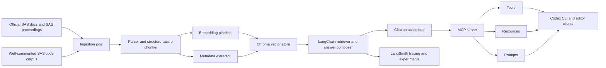
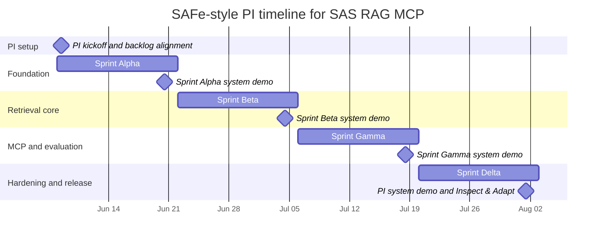

# SAFe PI Plan and Roadmap for a SAS RAG MCP Application Using LangChain

## Executive summary

This plan assumes **no specific constraint** on cloud provider, model provider, or team size, so it proposes a lean **SAFe-style** Program Increment shaped around one cross-functional product squad rather than a full multi-team Agile Release Train. That is still consistent with SAFe’s emphasis on cross-functional teams having the skills needed to define, build, test, and deliver value, and it fits your role as product/tech lead. Because SAFe PI Planning is typically run on an **8–12 week cadence**, and SAFe features are expected to fit within a PI, an **8-week PI with four 2-week iterations** is the cleanest fit for your requested 6–8 week window. citeturn31search5turn29search3turn30search24turn31search3

The recommended MVP should be **tool-first, corpus-first, and evaluation-first**. In practice, that means prioritizing: ingestion of official SAS documentation and SAS proceedings/support papers; structure-aware chunking for SAS docs and code; Chroma-backed retrieval with metadata and lexical filters; grounded answers with citations; a local **stdio** MCP server for Codex/Copilot; and LangSmith-driven offline experiments and regression gates. This sequence aligns with LangChain’s retrieval and MCP integration model, MCP’s standardized server features, Chroma’s support for persistent local development and query-time filtering, and LangSmith’s dataset/experiment workflow for benchmarking and regressions. citeturn28view0turn41search1turn41search0turn41search4turn41search3turn7view2turn10view0turn34search2turn13view3turn13view1

For the vector layer, the best default for this PI is **Chroma**, because it supports local in-memory and persisted operation, can also connect to a Chroma server, and exposes **similarity search, metadata filters, and full-text / regex document search**. Keep the store behind an interface so you can switch or supplement with **FAISS** later if large local indexes, GPU acceleration, or more explicit speed/recall trade-offs become dominant concerns. citeturn7view2turn10view0turn34search0turn34search2turn35view0

The most important architectural caveat is about **GitHub Copilot integration**. The MCP specification supports **tools, resources, and prompts**, but GitHub repository-level MCP configuration for **Copilot cloud agent and Copilot code review currently supports only MCP tools**, not resources or prompts. It also warns that Copilot may use configured tools autonomously. So the server should still implement resources/prompts for broader standards compliance and non-GitHub clients, but your first production surface for GitHub should expose the highest-value functionality as **narrow, least-privilege tools**. citeturn41search1turn41search0turn41search4turn41search3turn38view1

## Planning assumptions and target architecture

The initial corpus should focus on **official SAS sources** before community material. A strong starting set is: SAS programming documentation downloads; **SAS 9.4 SQL Procedure User’s Guide**; **SAS 9.4 Macro Language: Reference**; **SAS 9.4 Language Reference: Concepts**; DATA step definitions/statements references; and official SAS proceedings/support papers. This gives you a high-authority base covering syntax, concepts, procedures, macros, and example-heavy paper content. citeturn15search0turn15search6turn15search12turn17search9turn17search13turn32search1

The chunking strategy should be **dual-path** rather than generic-only. LangChain’s RecursiveCharacterTextSplitter is explicitly recommended as a good baseline for generic text, but SAS content has strong native structural boundaries that matter for retrieval quality. SAS DATA steps are defined as beginning with a `DATA` statement and ending with `RUN`, and the macro language is character-based, which makes it worth adding a SAS-aware splitter that chunks on `PROC … RUN/QUIT`, `DATA … RUN`, `%MACRO … %MEND`, headings, and code-comment boundaries instead of relying only on uniform character windows. citeturn11search11turn17search13turn17search16

The target architecture should keep **retrieval, grounding, and MCP exposure** distinct. LangChain can orchestrate document loading, chunking, embeddings, retrievers, and answer generation; Chroma can hold the indexed chunks and support similarity plus filter-based lookup; and the MCP server should expose the resulting capabilities as tools, resources, and prompts. LangChain’s MCP support also makes it straightforward to create an internal black-box test harness that connects back to your server through `stdio` or HTTP and traces calls with LangSmith. citeturn28view0turn41search1turn41search0turn41search4turn41search3turn34search2turn10view0



For transport, the order of operations should be deliberate. Start with **stdio** for local developer workflows, because MCP’s stdio transport is the simplest local fit and the spec treats local subprocess communication as the standard pattern. Add **Streamable HTTP** only after the stdio path is stable, especially if you want shared staging or repository-level GitHub integration. For HTTP transport, the spec requires strong security hygiene: validate `Origin`, bind only to localhost for local hosting, and implement authentication. For sensitive remote servers, MCP guidance recommends **OAuth 2.1-style authorization**; for local stdio servers, environment-based credentials are acceptable. citeturn40view2turn40view1turn39search16

## PI objectives and backlog hierarchy

The backlog below is mapped to the SAFe hierarchy on purpose. SAFe’s enterprise backlog structure flows from **epics to capabilities to features to stories**; features should fit inside a PI; and enablers cover **exploration, architecture, infrastructure, and compliance** work. That hierarchy is a good fit here because the project has a clear separation between business value delivered to users and technical runway required to make that value reliable. citeturn30search25turn29search3turn30search21turn30search2

The proposed PI objectives below are **recommended targets**, not externally mandated thresholds. They are designed so that success is measurable in business-value terms rather than output alone. citeturn31search3

| PI objective | Why it matters | Proposed success metric by PI end |
|---|---|---|
| Authoritative SAS corpus indexed with provenance | Without trustworthy source coverage, the RAG layer will not be dependable | At least 90% of prioritized official doc families loaded; parse failure rate below 2%; 100% of chunks carry source URI, title, version, section, and chunk ID |
| Grounded SAS Q&A over MCP for local clients | This is the first end-user value slice | Retrieval recall@5 at or above 0.85 on the curated benchmark; citation accuracy at or above 95%; unsupported-answer rate below 5% |
| Reliable regression and experiment loop | Prevents silent quality decay as prompts, chunking, or embeddings change | LangSmith baseline experiment created; regression suite runs on every PR and nightly; no merge when core metrics drop by more than 3 percentage points |
| Reproducible, secure delivery path | You need the system to be runnable by humans and agents | One-command local run; Docker image builds cleanly; GitHub Actions green on lint/test/eval/build; no open high/critical security findings at release |
| GitHub/Copilot-ready MCP surface | Needed if you want Copilot and coding CLI workflows to work cleanly | Stable tool schemas published; local Codex/Copilot integration proven; remote HTTP deployment design complete and tool-first |

The MVP should prioritize **official documentation search and explanation before code synthesis sophistication**. In other words, first ship strong retrieval against official docs and papers; then add code-aware chunking, code examples, and higher-order generation workflows once citation support is stable.

| SAFe level | Proposed item                   | Value / rationale                                                                      | Priority |
| ---------- | ------------------------------- | -------------------------------------------------------------------------------------- | -------- |
| Epic       | Trusted SAS knowledge platform  | Create a factual, citation-first SAS assistant surface usable by MCP-native clients    | P0       |
| Capability | Corpus ingestion and provenance | Import authoritative SAS material with stable metadata and re-indexing controls        | P0       |
| Feature    | Official SAS docs ingestion     | Load SAS docs, title pages, procedures, macro docs, concepts, and proceedings          | P0       |
| Feature    | Provenance schema               | Store source URI, version, section path, headings, page/chunk IDs, code/document type  | P0       |
| Enabler    | Parser adapter layer            | HTML/PDF/code loaders, normalization, deduplication, checksum/version tracking         | P0       |
| Capability | Retrieval and grounding         | Deliver correct, source-backed retrieval before advanced generation                    | P0       |
| Feature    | Structure-aware chunking        | Separate doc chunker and SAS code chunker using SAS-native boundaries                  | P0       |
| Feature    | Hybrid retrieval profile        | Semantic retrieval plus metadata and lexical filters for precise PROC/statement lookup | P0       |
| Feature    | Citation assembler              | Return answer spans with exact source references and chunk links                       | P0       |
| Enabler    | Benchmark dataset               | Curated SAS questions and expected source chunks for recall/citation evaluation        | P0       |
| Capability | MCP interaction layer           | Make the system consumable by Codex, Copilot, and any MCP client                       | P0       |
| Feature    | Local stdio MCP tools           | `search_sas_docs`, `get_sas_section`, `explain_sas_code`, `recommend_proc`             | P0       |
| Feature    | MCP resources and prompts       | Browsable doc resources and workflow prompts for non-GitHub MCP clients                | P1       |
| Feature    | Streamable HTTP transport       | Shared staging / remote deployment path with auth                                      | P1       |
| Enabler    | Tool schema versioning          | Deterministic, documented JSON schemas and contract tests                              | P1       |
| Capability | Delivery and operations         | Make the system repeatable, observable, and safe to change                             | P0       |
| Feature    | Dockerized local environment    | Reproducible local launch for developers and evaluations                               | P0       |
| Feature    | GitHub Actions CI/CD            | Lint, unit, integration, eval, image build, release                                    | P0       |
| Feature    | LangSmith observability         | Trace retrieval and agent behavior; compare experiments to baseline                    | P0       |
| Enabler    | Security and secret management  | OIDC, environment protections, least privilege, auth hardening                         | P0       |

## PI roadmap and sprint plan

This PI uses **four 2-week iterations** inside an 8-week plan. That mirrors SAFe’s common PI cadence while keeping iteration reviews and system demos frequent enough to surface retrieval and citation problems early. In SAFe, iteration planning is explicitly framed around a 2-week timebox, and the system demo is meant to provide an objective measure of progress toward PI objectives. citeturn31search5turn30search12turn31search11



| Sprint | Goal | Key stories and tasks | Primary owners / roles | Acceptance criteria |
|---|---|---|---|---|
| Sprint Alpha | Establish the project foundation and corpus contract | Finalize product scope and source inventory; create repo scaffolding; add repo-level `AGENTS.md` and first skills; define metadata schema; stand up LangSmith project; create parser spikes for SAS docs and code; create persistent local Chroma environment; decide chunking conventions | Product/Tech Lead, Data Engineer, Backend Engineer, DevOps | `make dev` or equivalent boots the repo; at least one official SAS doc family and one paper family ingest end-to-end; chunk metadata schema documented; traces visible in LangSmith; architecture ADR approved |
| Sprint Beta | Deliver retrieval MVP over official SAS sources | Build ingestion pipeline for prioritized SAS docs; implement structure-aware chunker; create embeddings and indexing job; expose retrieval service in LangChain; add first answer-with-citations chain; create benchmark dataset v1; run first recall and citation smoke tests | Data Engineer, ML Engineer, Backend Engineer, QA | At least 50 benchmark questions in dataset; retrieval recall@5 at or above 0.75 on smoke set; answers return source-backed citations; demo shows 10 representative SAS questions answered from official docs |
| Sprint Gamma | Expose the system through MCP and tighten grounding | Implement local stdio MCP server; publish tool schemas; add MCP resources/prompts for non-GitHub clients; integrate Codex/Copilot locally; harden citation formatting; add LangChain MCP harness for black-box server tests; design HTTP auth/session flow | Backend Engineer, ML Engineer, Product/Tech Lead, QA | Local Codex or Copilot can call the server successfully; core tools are contract-tested; citation accuracy reaches at least 0.90 on benchmark; resources/prompts available for local MCP clients; black-box MCP tests pass |
| Sprint Delta | Harden, secure, release, and demo | Add Streamable HTTP deployment path; implement auth and least-privilege scopes; finalize Docker multi-stage build; add GitHub Actions pipelines; add regression-quality gate; configure environments, secrets, and approvals; prepare release notes, ops runbook, and PI demo script | DevOps, Backend Engineer, QA, Product/Tech Lead | CI is green on lint/unit/integration/eval/build; protected deployment environment configured; remote HTTP server requires auth; final benchmark meets PI success metrics; live PI demo succeeds end-to-end |

A practical role simplification for this PI is to have **you** act as the backlog owner, architecture decision-maker, and PI objective acceptance owner, while the rest of the team handles delivery execution. That is slightly lighter than canonical SAFe role separation, but it is appropriate for a no-specific-constraint startup project.

## Quality dependencies and risk controls

LangSmith should be the backbone of your evaluation strategy. Its documented workflow is to **create a dataset, define evaluators, run experiments, and compare results**, and it explicitly supports **benchmarking, unit tests, regression tests, and backtesting**. It also supports setting a **baseline experiment** and comparing regressions and improvements side by side. For this project, that means every retrieval, prompt, chunking, embedding, or MCP schema change should eventually show up as a traceable experiment against the same benchmark dataset. citeturn13view3turn13view1turn13view2turn13view0

The evaluation program should have four layers. First, **retrieval relevance**: measure recall@k and MRR against labeled source chunks. Second, **answer quality**: score groundedness, correctness, and refusal behavior when the corpus does not support the answer. Third, **citation quality**: verify that cited chunks actually support the answer text and that citation metadata resolves cleanly back to the source. Fourth, **operational quality**: track latency, indexing freshness, and error rates from traces. LangSmith’s support for human, code-based, and LLM-as-judge evaluators is a good fit for this layered setup. citeturn13view3turn13view1

The recommended Definition of Done is below.

| Item type | Definition of done |
|---|---|
| Feature | Acceptance criteria met; unit and integration tests pass; eval impact recorded in LangSmith; docs or runbook updated; security review complete if auth/secrets/tool scope changed; demoable in system demo |
| Epic | All child features meet DoD; PI objective metric met or variance documented; architecture/runbook/rollback path published; stakeholders accept the result in PI review |
| Release candidate | CI green; regressions within agreed thresholds; deployment environment protections active; secrets validated; remote auth tested; known issues documented |

The project also has a small set of **hard dependencies** that should be surfaced in PI planning rather than discovered mid-sprint.

| Category | Item | Impact if late | Mitigation | Owner |
|---|---|---|---|---|
| Dependency | Final source inventory and rights decision for SAS docs, proceedings, and third-party code | Blocks ingestion scope and benchmark stability | Freeze a P0 source whitelist in Sprint Alpha; defer community code until legal/usage policy is clear | Product/Tech Lead |
| Dependency | Embedding/model provider selection | Affects retrieval characteristics and cost | Keep provider behind config; benchmark at least two candidate embedding setups | ML Engineer |
| Dependency | Benchmark question set | Without it, quality gates are subjective | Build dataset in parallel with ingestion starting Sprint Alpha | QA + ML Engineer |
| Dependency | Hosting target for HTTP MCP | Affects auth, network shape, and CI/CD | Keep PI MVP local-first; treat remote hosting as Sprint Delta hardening | DevOps |
| Risk | Citation drift or unsupported grounding | Undermines trust immediately | Make citation verification a release gate; require provenance on every chunk | ML Engineer |
| Risk | SAS code chunking performs poorly | Hurts code explanation and code-example retrieval | Use SAS-aware chunking and separate code/doc pipelines | Data Engineer |
| Risk | GitHub Copilot integration surprises | Repository-level GitHub integration supports only tools today | Make GitHub surface tool-first; keep resources/prompts as secondary interfaces | Backend Engineer |
| Risk | Over-privileged MCP tools | Copilot may invoke configured tools autonomously | Narrow tool scopes; read-only by default; explicit allowlists; least privilege secrets | Product/Tech Lead + Security/DevOps |
| Risk | Prompt injection or hostile content in source corpus | Can corrupt tool behavior or answer grounding | Sanitize source ingestion, keep tool instructions separate, minimize high-risk tools, add content filters and manual review for external code | Backend Engineer + QA |
| Risk | Remote HTTP server exposure | Local attacks and auth mistakes become possible | Follow MCP transport guidance: validate `Origin`, bind localhost for local servers, and add proper auth for remote access | DevOps |

Your CI/CD and security controls should be woven into those risks, not treated as a separate afterthought. GitHub Actions supports YAML-defined workflows; GitHub secrets should be accessed through the `secrets` context; non-secret sensitive values should be masked with `::add-mask::`; and GitHub explicitly recommends using **OIDC** with cloud providers when possible instead of storing long-lived credentials. Deployment environments support **required reviewers**, deployment branch/tag rules, and environment secrets that unlock only after protection rules pass. Docker should use **multi-stage builds** and **build secrets / secret mounts**, because Docker’s own docs say build args and environment variables are inappropriate for passing secrets into the image build since they persist in the final image. citeturn21view0turn22view0turn22view1turn22view2turn22view3turn22view4turn24view0turn24view2turn24view3

## Delivery model skills and governance

The delivery baseline should be: **Python MCP server**, **LangChain retrieval service**, **Chroma default vector store**, **LangSmith tracing/evals**, **Dockerized local dev image**, and **GitHub Actions** for lint/test/eval/build/release. For GitHub repository-level Copilot integration, remember that MCP server configuration is entered as **JSON** in repository settings, and server-specific secrets/variables must use the `COPILOT_MCP_` prefix. If the GitHub-hosted agent environment needs extra dependencies beyond runner defaults, GitHub documents using a `copilot-setup-steps.yml` workflow to install them. citeturn38view0turn38view1turn38view2

The MCP server itself should follow a **tool-first public contract** with a **standards-complete internal contract**. Concretely, that means: publish a small stable set of tools first; implement resources/prompts as soon as practical for local clients and future compatibility; use stdio locally; add Streamable HTTP only when auth, observability, and tool scoping are ready; and keep all retrieval/business logic behind versioned internal service interfaces so the MCP layer stays thin. MCP’s official Python SDK supports servers exposing tools, resources, and prompts over stdio, SSE, and Streamable HTTP, while LangChain’s MCP adapters can consume those tools inside testing or orchestration flows. citeturn26search0turn26search2turn26search4turn28view0

Because Codex skills use progressive disclosure and the initial skill inventory is capped to a small share of the context window, you should prefer **a short list of sharply named, sharply described skills** over dozens of overlapping ones. A skill is a directory with a `SKILL.md` file plus optional scripts/references/assets, and the `SKILL.md` must include at least `name` and `description`. `AGENTS.md` should stay concise and document repo layout, commands, conventions, constraints, and what “done” means. citeturn36view0turn36view1turn36view2turn36view3

Recommended repo-local skills, assuming a convention such as `./.agents/skills/`:

| Exact skill folder name | Purpose | Start in PI |
|---|---|---|
| `.agents/skills/sas-corpus-curation` | Source whitelist, source metadata policy, version tracking, provenance rules | Yes |
| `.agents/skills/sas-structure-aware-chunking` | SAS-aware chunk boundaries for docs, PROC, DATA step, macros, and code comments | Yes |
| `.agents/skills/langchain-retrieval-pipeline` | LangChain retriever composition, prompt patterns, chain wiring, reranker hooks | Yes |
| `.agents/skills/chroma-index-admin` | Chroma collection setup, persistence, filters, reindex/rebuild commands, schema notes | Yes |
| `.agents/skills/citation-grounding` | Citation formatting policy, evidence checks, refusal rules when evidence is weak | Yes |
| `.agents/skills/mcp-server-tools` | Tool schema conventions, naming, versioning, contract tests, stdio launch commands | Yes |
| `.agents/skills/mcp-http-auth` | Streamable HTTP transport, auth flow, session headers, localhost/origin safety rules | Later |
| `.agents/skills/langsmith-rag-evals` | Dataset curation, experiment comparison, baseline procedure, regression thresholds | Yes |
| `.agents/skills/github-actions-release` | Workflow templates, quality gates, image build/publish, branch protection expectations | Yes |
| `.agents/skills/docker-local-dev` | Dockerfile, compose/local run, cache strategy, build secrets, local test commands | Yes |
| `.agents/skills/copilot-codex-mcp` | Local client setup notes, MCP config snippets, known GitHub/Copilot constraints | Later |
| `.agents/skills/security-secrets-oidc` | Secret handling, OIDC guidance, least-privilege tooling, redaction rules | Yes |

A sensible staffing shape for an 8-week PI is below. This is a **lean squad estimate**, not a full ART staffing model.

| Role | Recommended FTE through PI | Person-weeks | Focus |
|---|---:|---:|---|
| Product/Tech Lead | 0.5 | 4 | Backlog, architecture, source policy, acceptance, demos |
| Data Engineer | 0.75 | 6 | Ingestion, parsing, metadata, reindexing |
| ML/RAG Engineer | 1.0 | 8 | Embeddings, retrieval, prompt/citation logic, evals |
| Backend Engineer | 1.0 | 8 | MCP server, service APIs, contracts, client integration |
| DevOps/SRE | 0.5 | 4 | Docker, CI/CD, environments, auth, deployment |
| QA/Automation Engineer | 0.5 | 4 | Benchmark curation, regression automation, acceptance tests |
| **Total** |  | **34** |  |

The milestone plan and PI review should mirror SAFe’s emphasis on **system demos** and **Inspect & Adapt**. The system demo is the objective measure of progress; I&A is where actual results, measurements, and improvements are reviewed at PI end. citeturn31search11turn31search2

| Milestone | Target timing | Evidence |
|---|---|---|
| Architecture and source whitelist ratified | End of Sprint Alpha | ADR, source register, metadata schema |
| Retrieval MVP demo | End of Sprint Beta | 10-question live demo with citations |
| MCP local-client demo | End of Sprint Gamma | Codex/Copilot local session calling MCP tools |
| Release candidate | End of Sprint Delta week 1 | Green CI, remote HTTP auth path, regression report |
| PI system demo and I&A | Final PI day | Live end-to-end workflow, actual-vs-planned metrics, improvement backlog |

A strong **PI review/demo agenda** is:

1. Business context and PI objective recap.
2. Live ingestion/provenance walkthrough.
3. Live SAS Q&A demo with citations over MCP from a coding client.
4. Retrieval metric review and LangSmith experiment comparison versus baseline.
5. Security and deployment walkthrough.
6. Actual versus planned business value, risks, and next-PI improvement backlog.

**Template for `SKILL.md`**

The template below follows the documented skill structure: directory-based skill, YAML front matter with `name` and `description`, plus optional scripts/references/assets alongside it. citeturn36view0

```md
---
name: sas-structure-aware-chunking
description: Use when changing SAS document parsing, chunking, code segmentation, or provenance metadata. Do not use for UI-only or deployment-only work.
---

# Purpose

Preserve SAS-native structure so retrieval is accurate for DATA steps, PROC blocks, macros, statements, and commented examples.

# When to use

- Changes to loaders, parsers, splitters, metadata extraction, or re-indexing
- New SAS source families added to the corpus
- Retrieval failures caused by bad chunk boundaries

# Inputs expected

- Source type: html, pdf, sas-code
- Source metadata: title, product, version, url, doc family
- Desired output schema: chunk_id, source_uri, heading_path, object_type, start_offset, end_offset

# Rules

- Split docs on heading hierarchy before size-based fallback
- Split SAS code on:
  - `PROC ... RUN;` or `PROC ... QUIT;`
  - `DATA ... RUN;`
  - `%MACRO ... %MEND;`
- Preserve nearby comments with the code block they explain
- Do not emit chunks without provenance metadata
- Prefer smaller chunks for syntax definitions and larger chunks for conceptual narratives

# Commands

- Run parser tests: `make test-parsers`
- Run chunk contract tests: `make test-chunking`
- Rebuild sample index: `make reindex-sample`

# Acceptance checks

- Chunk schema validation passes
- No orphan chunks
- Benchmark recall does not regress
- At least 5 representative SAS examples manually inspected

# References

- `references/sas-chunking-guidelines.md`
- `references/provenance-schema.md`
```

**Template for `AGENTS.md`**

This template reflects OpenAI’s guidance that `AGENTS.md` should stay concise, travel with the repo, and cover commands, conventions, constraints, and definitions of done. Repo-level and nested overrides are both supported. citeturn36view1turn36view2turn36view3

```md
# AGENTS.md

## Repository purpose

This repo builds a SAS retrieval-augmented generation system and exposes it through an MCP server for coding clients such as Codex and GitHub Copilot.

## Working agreements

- Prefer source-backed answers over fluent but weakly grounded answers.
- Never remove provenance metadata from indexed chunks.
- Treat official SAS documentation as the default authority.
- Ask for approval before adding new production dependencies or changing deployment topology.

## Repo map

- `src/ingest/` ingestion, parsing, normalization
- `src/index/` embeddings and vector-store operations
- `src/retrieval/` retrievers, prompts, citations
- `src/mcp_server/` MCP tool/resource/prompt surfaces
- `tests/` unit, integration, regression
- `.agents/skills/` reusable repo-local skills
- `docs/` ADRs, runbooks, benchmark notes

## Commands

- Install deps: `make setup`
- Run app locally: `make dev`
- Run tests: `make test`
- Run eval smoke suite: `make eval-smoke`
- Rebuild sample index: `make reindex-sample`
- Build Docker image: `make docker-build`

## Engineering conventions

- Keep MCP tool schemas stable and versioned.
- Keep retrieval logic separate from transport logic.
- Prefer config-driven model and embedding selection.
- Add traces for new retrieval or MCP flows.
- Update docs when behavior, commands, or contracts change.

## Security rules

- Never hardcode credentials.
- Use environment variables or secret stores only.
- Minimize MCP tool scope and default to read-only behavior.
- For remote HTTP work, preserve auth and origin-validation checks.

## Done means

A change is done when:
- tests pass,
- relevant evals run,
- docs or runbooks are updated,
- security impact is reviewed,
- and the result is demoable.
```

## Open questions and limitations

A few inputs were not specified, and they will materially affect the final implementation details. The biggest open questions are: whether the corpus should cover **SAS 9.4 only or both SAS 9.4 and Viya**; what rights policy you want for **third-party commented SAS code** versus official SAS materials; whether the remote MCP target is only **local IDE/CLI** or also **GitHub cloud agent / code review**; and which embedding/model providers are acceptable for cost, privacy, and latency. The roadmap above is therefore strongest as a **PI-starting plan**, with technical depth calibrated for a first production-grade MVP rather than a final enterprise platform.

## Actionable next steps

- Freeze a **P0 corpus whitelist** this week: official SAS docs, macro reference, SQL procedure guide, language reference, DATA step references, and SAS proceedings.
- Create the repo scaffolding immediately: `AGENTS.md`, `.agents/skills/`, `src/ingest`, `src/retrieval`, `src/mcp_server`, `tests`, and `docs/`.
- Build **two chunkers**, not one: a generic text chunker and a SAS-aware code/doc chunker.
- Make the first MCP surface **tool-only for GitHub compatibility**, even if you also implement resources/prompts for local clients.
- Stand up **LangSmith on day one** and refuse to ship without a baseline dataset and comparison experiment.
- Treat **citation accuracy** as the release gate that matters most for this PI.